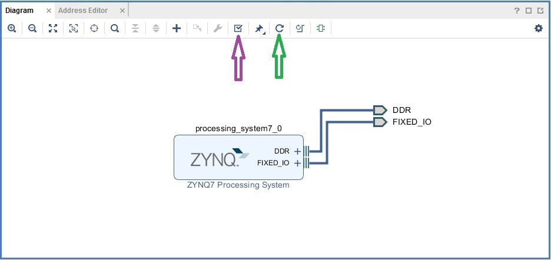
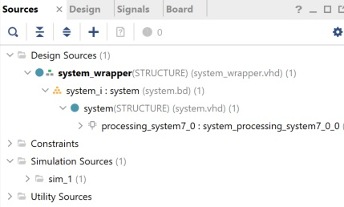

# Use Vivado to build an Embedded System

## Objectives

After completing this lab, you will be able to:
*	Create a Vivado project for a Zynq system.
*	Use the IP Integrator to create a hardware system
*	Use SDK(Software Development Kit) to create a standard memory test project
*	Run the test application on the board and hence verify hardware functionality


## Steps
### Create a Vivado Project

1.	Open Vivado 
1.	Click **Create New Project** to start the wizard. You will see the Create a New Vivado Project dialog box. Click Next.
1.	Click the Browse button of the Project Location field of the New Project and browse to **{labs}**, and click Select.
1.	Enter **lab1** in the Project Name field.  Make sure that the Create Project Subdirectory box is checked.  Click Next.
1.	In the Project Type form select **RTL Project**, and click Next
1.	In the Add Sources form, select Verilog as the Target language and **Mixed** as the Simulator language, and click Next
1.	Click Next two more times to skip Adding Existing IP and Add Constraints
1.	In the Default Part window, select the Boards tab, and depending on the board you are using, (if you can't find the board you are looking for, refer to [README.md]() for setup) and click Next.

    

1. Check the Project Summary and click Finish to create an empty Vivado project.


### Creating the System Using the IP Integrator

1.	In the Flow Navigator, click **Create Block Design** under IP Integrator

    

1.	Enter **system** for the design name and click **OK**

1.	Right-click anywhere in the Diagram workspace and select **Add IP**.
    
   


1.	Once the **IP Catalog** opens, type “zynq” into the Search bar, find and *double click* on **ZYNQ7 Processing System** entry, or click on the entry to select it, and press *Enter* to add it to the design.

1. Notice the message at the top of the Diagram window in a green label saying that *Designer Assistance* available. 

    Block Automation can automatically apply settings to a block. In this case, the Zynq block can be automatically configured based on settings in the board files we are using. 

1.	Click **Run Block Automation**.  

1.	A new *Run Block Automation* window opens. In it, select **/processing_system7_0**, leave the default settings and click **OK**

1. Once *Block Automation* completes, notice ports have been automatically added for the DDR and Fixed IO, and some additional ports are now visible. The default configuration from the board files we are using have been applied to the Zynq block. 

    The block should look like this:

    

1. Double-click on the added block to open its **Customization** window.
   Notice now the Customization window shows selected peripherals (with tick marks). This is the default configuration for the board applied by the block automation.

###	Configure the processing block 

The default configuration has enabled enabled all peripherals on the board. This lab only uses the UART. We will go though the process of disabling other settings that won't be used in this lab. This will show you how to enable/disable and change settings for the Zynq block. 

1. A block diagram of the Zynq should now be open again, showing various configurable blocks of the **Processing System**.

1. At this stage, you can click on various configurable blocks (highlighted in green) and change the system configuration.

1. Click on one of the peripherals (in green) in the **IOP Peripherals** block of the Zynq Block Design to jump to the MIO configuration tab, or select the MIO Configuration tab on the left 

1.	Expand **I/O peripherals** if necessary

   >**Note :** UART 0 should already be selected for PYNQ-Z2, and UART 1 will be selected for PYNQ-Z2

1. Ensure all the following I/O peripherals are **deselected** except UART.

    * ENET
    * USB 0
    * SD 0
    * Expand **GPIO** to deselect GPIO MIO
    * Expand **Memory Interfaces** to deselect Quad SPI Flash
    * Expand **Application Processor Unit** to disable Timer 0 (if necessary).

   


1.	Select the **PS-PL Configuration** tab on the left.
1.	Expand **AXI Non Secure Enablement > GP Master AXI interface** and deselect M AXI GP0 interface.
1.	Expand **General > Enable Clock Resets** and deselect the *FCLK_RESET0_N* option.
1.	Select the **Clock Configuration** tab on the left. Expand the PL Fabric Clocks and deselect the *FCLK_CLK0* option and click **OK**.
1. Click on the **Regenerate Layout button** (green arrow) shown below:

   

1.	Click on the **Validate Design button** (purple arrow) and make sure that there are no errors.

### Generate Top-Level and Export the hardware design

Generate IP Integrator Outputs, the top-level HDL, and start SDK by exporting the hardware.
1.	In the sources panel, right-click on **system.bd**, and select **Generate Output Products…** and click Generate to generate the Implementation, Simulation and Synthesis files for the design (You can also click on **Generate Block Design** in the Flow Navigator pane to do the same)

1.	Right-click again on *system.bd*, and select Create **HDL Wrapper…** to generate the top-level VHDL model. Leave the option *Let Vivado manager wrapper and auto-update* selected, and click OK

   The system_wrapper.vhd file will be created and added to the project.  Double-click on the file to see the content in the Auxiliary pane.
   
   
   
1. Notice that the VHDL file is already Set As the Top module in the design, indicated by the icon  

1. Select **File > Export > Export hardware** and click OK. (Save the project if prompted)
   Note:  Since we do not have any hardware in Programmable Logic (PL) there is no bitstream to generate, hence the Include bitstream option is not necessary at this time.

   This will create an **XSA** file called **system_wrapper.xsa**

# Build the software application

1. Launch Vitis

1. Create a new folder called workspace in {labs}/lab1and select this as the Vitis directory workspace

1. Select **Create Application Project** and enter **lab1** as the project name and click **Next**

   

1. Select the Create a new platform from hardware (XSA) tab

1. Click on the + symbol, and browse ti {labs}/lab1 and select the **system_wrapper.xsa** created in the previous section

   

1.	Click **Next** 

1.	Leave the default settings in the Domain section and click **Next** 

    

1.	Select **Memory Tests** and click **Finish**

    

The software project will be created.

## Compile the application

1. Compile the software project by selecting the *build icon*  or by right clicking on the lab1_system project, and selecting **Build Project**

1.	Open the memorytest.c file in the mem_test project (under src), and examine the contents.  This file calls the functions to test the memory.

## Test in Hardware

1.	Setup the hardware as describe in README.md
1.	In the *Vitis Serial Terminal* panel, click on the **Connect** button (shown in the red box bleow)

   
   
1. Select the appropriate COM port number and configure with the following parameters:


   The COM port number will depend on your computer. You can find the COM port from the Windows Device Manager
    
1.	Click on the *run icon*  or right click and select **Run As > Launch on Hardware (System Debugger)**

1.	You should see the following output on the Terminal tab.
    
```
   NOTE: This application runs with D-Cache disabled.As a result, cacheline requests will not be generated

Testing memory region: ps7_ddr_0
    Memory Controller: ps7_ddr_0
         Base Address: 0x100000
                 Size: 0x1FF00000 bytes 
          32-bit test: PASSED!
          16-bit test: PASSED!
           8-bit test: PASSED!

Testing memory region: ps7_ram_1
    Memory Controller: ps7_ram_1
         Base Address: 0xFFFF0000 
                 Size: 0xFE00 bytes 
          32-bit test: PASSED!
          16-bit test: PASSED!
           8-bit test: PASSED!

--Memory Test Application Complete--
```

# Conclusion

Vivado and the IP Integrator allow base embedded processor systems and applications to be generated very quickly. After the system has been defined, the hardware can be exported as an XSA for use with Vitis. 

Software development is done in Vitis. Example applications can be used to do some basic tests of your system.  

You verified the operation of the hardware by using a test application, executing on the processor, and observing the output in the serial terminal window.
